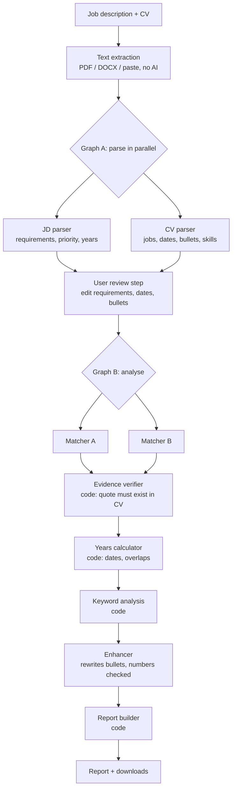

# 🎯 CareerFit AI

**Match Your Skills. Improve Your CV. Apply with Confidence.**

CareerFit AI compares a CV with a job description, shows which requirements are met, unclear or missed, and suggests CV wording that only uses terms the CV already supports. It focuses on **evidence and honesty** instead of an arbitrary match percentage.

- **Live app:** https://careerfit-ai-v01.streamlit.app/  _(the first load after a quiet period can take a minute)_
- **Code:** https://github.com/bilal-rabbani/CareerFit-AI

## What it does

1. Upload or paste a job description and a CV (PDF, DOCX or text).
2. The AI extracts requirements and CV facts. **You review and correct them.**
3. Every requirement gets a verdict with a quote from your CV as evidence.
4. You get missing keywords, split into *your CV supports this* and *add only if you truly have this*, plus reworded bullets.
5. Download the report as Markdown or HTML (print to PDF).

## Workflow



## What makes it different

| Promise | How it is enforced |
|---|---|
| No invented qualifications | A "meets" verdict needs a quote from the CV. Code checks the quote exists (normalised and fuzzy match) and downgrades the verdict if not |
| Honest years of experience | Calculated in code from parsed dates, with overlapping jobs counted once. Year-only dates give a range, and an ambiguous range gives "unclear" |
| Keywords only when supported | A keyword is suggested only if a verified "meets" backs it. Everything else is listed as "add only if true" |
| No invented numbers in rewrites | The enhancer's output is rejected if it contains a figure that isn't in the original bullet |
| Prompt-injection resistance | CV and JD text is wrapped and labelled as data, the prompts say to ignore embedded instructions, and an evaluation case tests this |
| Privacy | Nothing is written to disk. Results stay in memory for up to an hour to save API calls. API keys live only in the browser session and are never logged |

## Free-tier friendly design

- **Bring your own keys:** up to 6 Groq or Gemini keys. Each pipeline step has a key slot, one key works for everything, and several keys spread the load.
- Retry with backoff, rate-limit fallback to the next key, and a "Test keys" button.
- Per-document caching, so retries only repeat the part that failed.
- A shared demo key with per-session and daily caps.

## Evaluation

Evaluated on **hand-built synthetic cases** with hand-labelled expected verdicts. The sample is small, so read the numbers as a rough guide, not a benchmark. The full table, per-case results and the bug report are in [`evaluation/`](evaluation/).

| Metric | Result | Target | |
|---|---|---|---|
| Requirements found by the JD parser | 4.3% | >= 90% | check |
| Priority correct (must vs nice) | 100.0% | >= 90% | pass |
| Years requirement correct | 100.0% | >= 95% | pass |
| Verdict acceptable (of found) | 100.0% | >= 85% | pass |
| Verdict exactly the ideal one (of found) | 100.0% | info |  |
| End to end acceptable (of all gold) | 4.3% | info |  |
| Critical errors: false 'meets' | 0 | 0 | pass |
| 'Meets' without verified evidence | 0 | 0 | pass |
| Trap keywords wrongly suggested | 0 | 0 | pass |
| Injected text echoed in the report | 0 | 0 | pass |
| Suggestions with invented numbers | 0 | 0 | pass |
| Expected keyword suggestions produced | 0 of 2 | info |  |
| Known-limitation probes triggered | 0 | info |  |

## Known limitations

- Scanned or image-only PDFs can't be read (OCR is too heavy for the free tier). Paste the text instead.
- "Verified" means the quoted text exists in the CV. It doesn't prove the quote fully satisfies the requirement, so the evidence is always shown.
- Requirements with alternatives ("Salesforce or HubSpot") can be marked as met through either option.
- Soft skills are never scored.
- Free-tier models vary between runs and can be rate limited. Model names may need updating in `llm/config.py`.
- Output is a guide, not hiring advice.

## Run it yourself

```bash
git clone https://github.com/bilal-rabbani/CareerFit-AI.git
cd careerfit-ai
pip install -r requirements.txt
streamlit run app.py
```

Optional demo keys go in `.streamlit/secrets.toml` (never commit this file):

```toml
GROQ_API_KEY = "..."
GEMINI_API_KEY = "..."
```

## Project structure

## Tech

Python, Streamlit, LangGraph, Pydantic, Groq and Gemini REST APIs, pdfplumber, python-docx, rapidfuzz.
